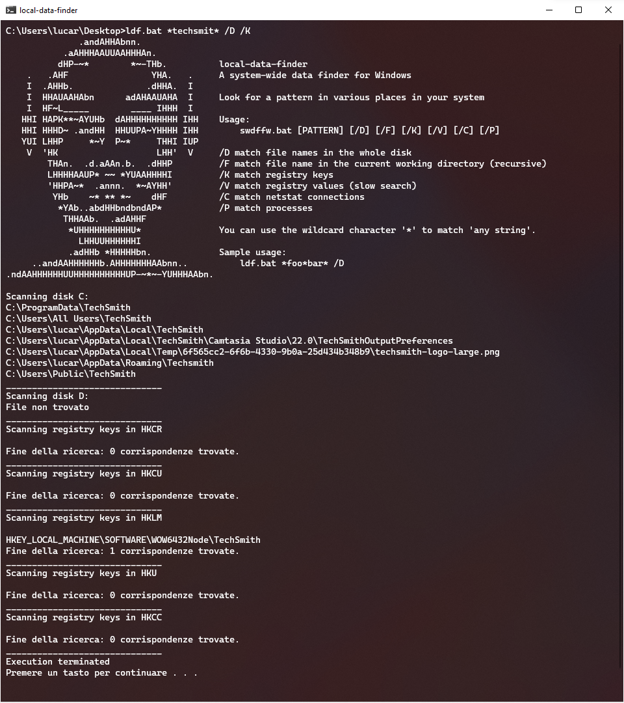
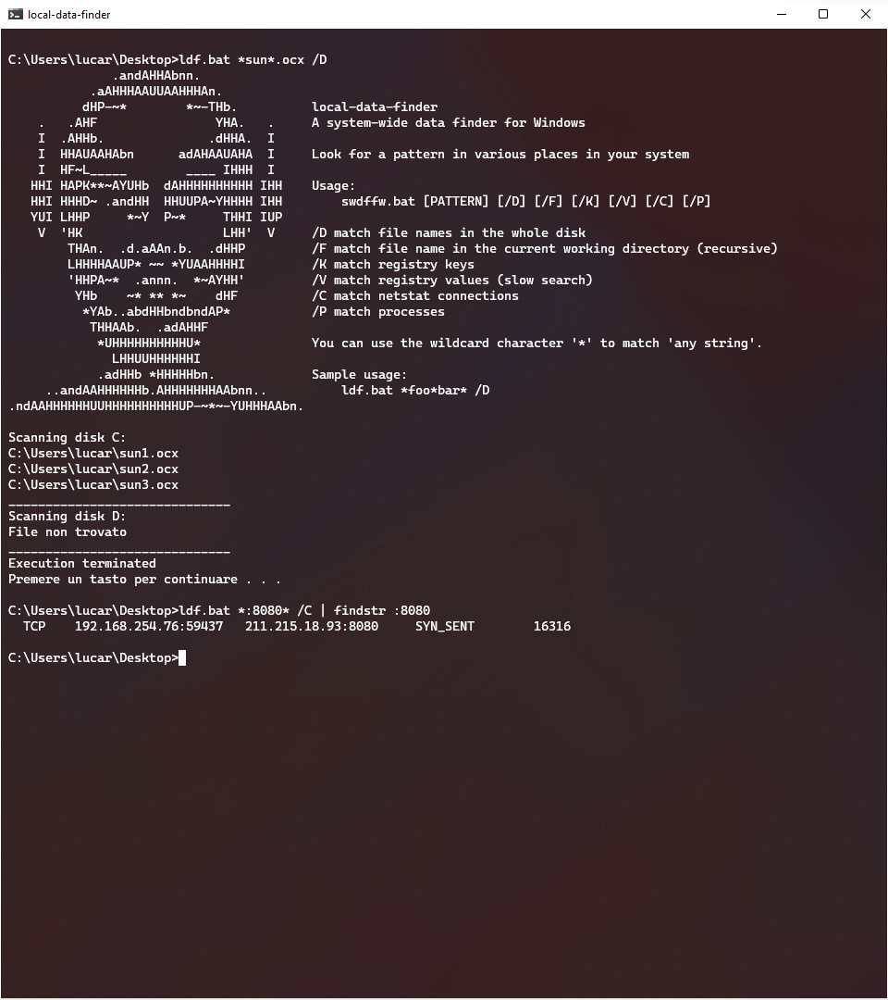

# local-data-finder
## A system-wide data finder for Windows

I wanted to make a simple script that uses Windows built in tools only. 

No additional tools, no Powershell policy bypass, no complex options... just the major features I use on a daily basis.

```
               .andAHHAbnn.               
            .aAHHHAAUUAAHHHAn.            
           dHP-~*        *~-THb.          local-data-finder
     .   .AHF                YHA.   .     A system-wide data finder for Windows
     I  .AHHb.              .dHHA.  I     
     I  HHAUAAHAbn      adAHAAUAHA  I     Look for a pattern in various places in your system
     I  HF~L_____        ____ IHHH  I     
    HHI HAPK**~AYUHb  dAHHHHHHHHHH IHH    Usage:
    HHI HHHD~ .andHH  HHUUPA~YHHHH IHH        swdffw.bat [PATTERN] [/D] [/F] [/K] [/V] [/C] [/P] [/S] [/A] [/I]
    YUI LHHP     *~Y  P~*     THHI IUP    
     V  'HK                   LHH'  V     /D match file names in the whole disk
         THAn.  .d.aAAn.b.  .dHHP         /F match file name in the current working directory (recursive)
         LHHHHAAUP* ~~ *YUAAHHHHI         /K match registry keys
         'HHPA~*  .annn.  *~AYHH'         /V match registry values (slow search)
          YHb    ~* ** *~    dHF          /C match netstat connections
           *YAb..abdHHbndbndAP*           /P match processes
            THHAAb.  .adAHHF              /S match services
                                          /A match autoruns values (needs autorunsc64.exe from Syinternal Autoruns)
                                          /I match installed programs
             *UHHHHHHHHHHU*               You can use the wildcard character '*' to match 'any string'.
               LHHUUHHHHHHI               
             .adHHb *HHHHHbn.             Sample usage:
      ..andAAHHHHHHb.AHHHHHHHAAbnn..          ldf.bat *foo*bar* /D
 .ndAAHHHHHHUUHHHHHHHHHHUP-~*~-YUHHHAAbn. 
```

Use it to search for remnants of uninstalled software:


Use it to search IOC on your system:

